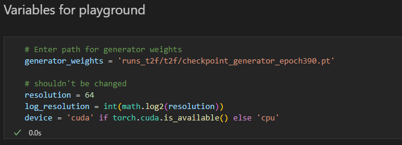

# Text-to-face with StyleGAN using CLIP.

This repository contains the combined work of a Machine Learning project in Advanced Topics in Machine Learning at Østfold University college about turning StyleGAN (more specifically StyleGAN2) into a text conditional network for face generation.

## Get started.

Install Python3.9 or higher. Older versions of Python might also work but make sure atleast to have Python3.

## Preparing the python environment
### Create the python environment:

    python3 -m venv <environment_path>

### Activate the environment (Linux)

    source <environment_path>/bin/activate

### Installing dependecies
Please activate your environment before doing the next step. The environment activation method is different based on your operating system.

    pip install -r requirements.txt

## Data format
Data should have the following format:

## Start training

This repository also supports training of the original StyleGAN. However, this network is uncoditional and only uses the images not text. Use `train_simple.py` to train the original version. Use `train_t2f.py` to train the text conditional StyleGAN.

By default parameters of training are set to give the same results as was achieved in the project report.

For training regular StyleGAN example:

    python3 train_simple.py --name <run_name> --real_folder t2f_data/images 

For training text-to-face StyleGAN example:

    python3 train_t2f.py --name <run_name> --real_folder t2f_data/images --descriptions_folder t2f_data/descriptions

Each training script each creates individual folders for runs of regular and t2f StyleGAN. `--name` argument indicates the name of the folder where Tensorboard logs and model weights are stored.

Open Tensorboard in the tensorboard folder of the name folder to view training statistics.

## `train_simple.py` arguments
* `--name` folder name for this run. Folder where weights and logging.
* `--real_folder` folder for images.
* `--w_dim` size of the latent space. Default 512
* `--image_size` size of generated images. Default 64.
* `--gen_lr` generator learning rate. Default 1e-3.
* `--map_lr` mapping net learning rate. Default 1e-5. 
* `--disc_lr` discriminator learning rate. Default 1e-3. 
* `--batch_size` batch size, needs to be dividable by 4. Default 64. 
* `--epochs` number of time to show each sample of the dataset. Default 400.
* `--overwrite` overwrite if --name already exist. Default False.
* `--save_every` save weights of models at every X epoch. Default 10.

## `train_t2f.py` arguments
* `--name` folder name for this run. Folder where weights and logging.
* `--real_folder` folder for images.
* `--descriptions_folder` folder containing the the descriptions.
* `--w_dim` size of the latent space. Default 512
* `--image_size` size of generated images. Default 64.
* `--gen_lr` generator learning rate. Default 1e-3.
* `--disc_lr` discriminator learning rate. Default 1e-3. 
* `--batch_size` batch size, needs to be dividable by 4. Default 64. 
* `--epochs` number of time to show each sample of the dataset. Default 400.
* `--overwrite` overwrite if --name already exist. Default False.
* `--save_every` save weights of models at every X epoch. Default 10.

## Training disclaimer
StyleGAN like many other generative models take pretty long to train. The results of this project were generated with 64x64 images. The training on the CelebA-HQ dataset which consist of 30,000 image with 10 descriptions per image took around 36 hours on a Nvidia volta v100 GPU. Training on PC might taking considerably longer time.

## Playground for text-to-face.
`playground.ipynb` is a small jupyter notebook which offers a small playground to write a description and see the generated image from the description. Here's the main steps. Currently, there is no playground for testing the regular StyleGAN.

## Enter a path for generator weights. (If you are an examinator these have been supplied to you.)

## Write a description

## Generate the image

